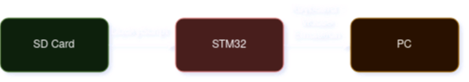
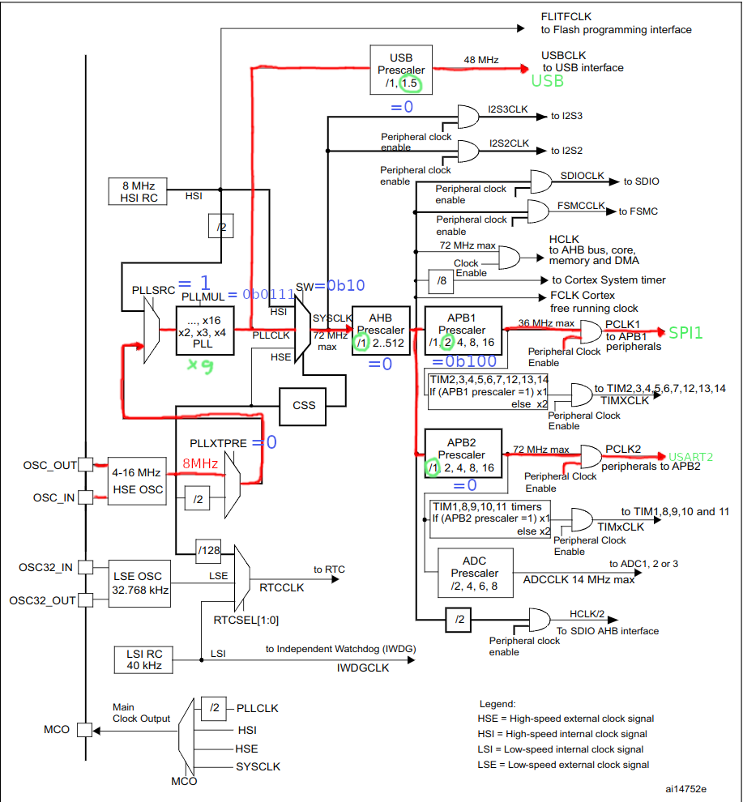

# Documentation  <!-- omit from toc -->
This folder contains the whole documentation of the project as well as usefull PDFs and links used in creation of the Rubber Ducky.

# Table of Contents  <!-- omit from toc -->
- [System Diagramm](#system-diagramm)
- [Datasheets](#datasheets)
  - [STM32F103C6T6](#stm32f103c6t6)
  - [STM32F103 Application Notes](#stm32f103-application-notes)
  - [Crystal Oscillator](#crystal-oscillator)
- [Schematic](#schematic)
  - [Calculations](#calculations)
    - [Oscillator](#oscillator)
  - [Pinouts](#pinouts)
- [Coding](#coding)
  - [RCC](#rcc)
    - [Need to enable](#need-to-enable)
    - [Clock Path](#clock-path)

# System Diagramm

# Datasheets

## STM32F103C6T6 
- [Reference Manual](https://www.st.com/resource/en/reference_manual/rm0008-stm32f101xx-stm32f102xx-stm32f103xx-stm32f105xx-and-stm32f107xx-advanced-armbased-32bit-mcus-stmicroelectronics.pdf)
- [Product Specs](https://www.st.com/resource/en/datasheet/stm32f103c6.pdf)
- [Errata](https://www.st.com/resource/en/errata_sheet/es0348-stm32f101x46-stm32f102x46-stm32f103x46-device-errata-stmicroelectronics.pdf)

## STM32F103 Application Notes
- [AN2867](https://www.st.com/resource/en/application_note/cd00221665-oscillator-design-guide-for-stm8af-al-s-stm32-mcus-and-mpus-stmicroelectronics.pdf)

## Crystal Oscillator
- [LFXTAL033863Reel](https://www.mouser.de/ProductDetail/IQD/LFXTAL033863Reel?qs=e4%2FAndAAwgIQqOoCaq8uAQ%3D%3D)

# Schematic

<image src=./schematic/stm32-rubberducky.svg>

## Calculations

### Oscillator
Calculations for the crystal oscillator formula from [AN2867 p.12](https://www.st.com/resource/en/application_note/cd00221665-oscillator-design-guide-for-stm8af-al-s-stm32-mcus-and-mpus-stmicroelectronics.pdf):

$$C_L = \frac{C_{L1} \cdot C_{L2}}{C_{L1} + C_{L2}} + C_{stray}$$
$$C_L - C_S = \frac{C_{L1} \cdot C_{L2}}{C_{L1} + C_{L2}}$$

with values of [LFXTAL033863Reel crystal](https://www.mouser.de/ProductDetail/IQD/LFXTAL033863Reel?qs=e4%2FAndAAwgIQqOoCaq8uAQ%3D%3D) and the stray capacitance mentioned in [Product Specs p. 48](https://www.st.com/resource/en/datasheet/stm32f103c6.pdf):

$$C_L - C_S = 20\text{pf} - 10\text{pf} = \frac{C_{L1} \cdot C_{L2}}{C_{L1} + C_{L2}}$$

Results in 

$$C_{L1} = C_{L2} = 20\text{pf}$$

Calculating the external Resistor $R_{EXT}$ with [AN2867 p.16](https://www.st.com/resource/en/application_note/cd00221665-oscillator-design-guide-for-stm8af-al-s-stm32-mcus-and-mpus-stmicroelectronics.pdf):

$$R_{EXT} = \frac{1}{2\pi f C_{L2}} = \frac{1}{2\pi\cdot 8\cdot 10^{6}\text{Hz} \cdot 20\cdot 10^{-12}\text{F} } = 994,718\Omega \approx 1\text{k}\Omega$$

Maybe the gain should be checked by the formula mentioned at the bottom of [AN2867 p.16](https://www.st.com/resource/en/application_note/cd00221665-oscillator-design-guide-for-stm8af-al-s-stm32-mcus-and-mpus-stmicroelectronics.pdf) but I will skip it because the $g_m$ parameter is not mentioned in the crystal datasheet.

## Pinouts
| **Physical Pin** | **Pin Name** | **Port**       |
|------------------|--------------|----------------|
| 32               | PA11         | USB D-         |
| 33               | PA12         | USB D+         |
| 15               | PA5          | SPI_SCK        |
| 16               | PA6          | SPI1_MISO      |
| 17               | PA7          | SPI1_MOSI      |
| 29               | PA8          | SPI1_CS (GPIO) |
| 12               | PA2          | USART2_TX      |
| 13               | PA3          | USART2_RX      |
| 34               | PA13         | SWDIO          |
| 37               | PA14         | SWCLK          |

# Coding

## RCC

### Need to enable
- RCC_CR
- ... 

### Clock Path
